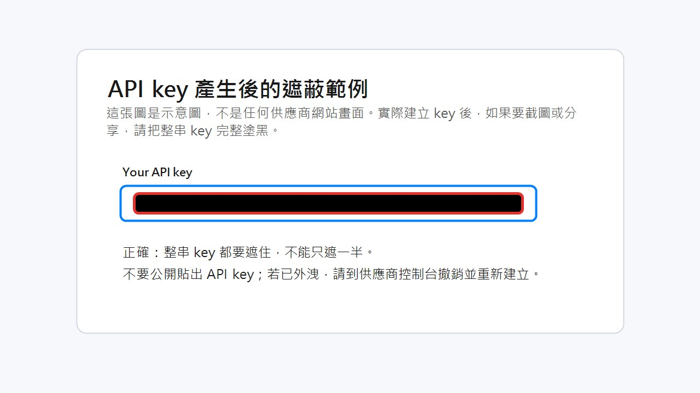
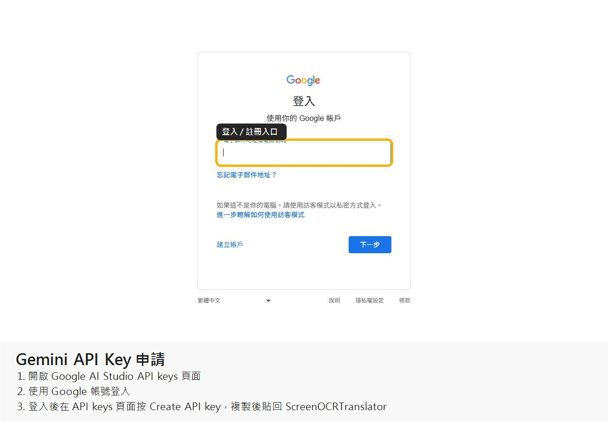
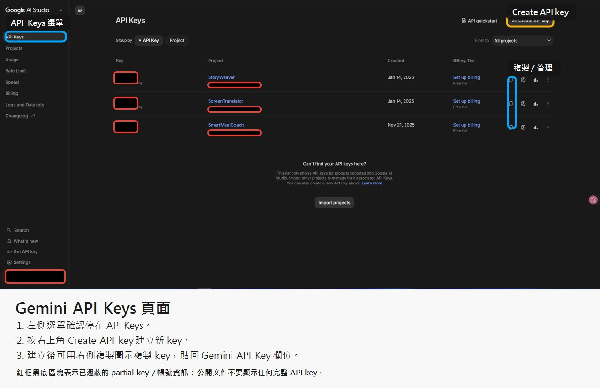
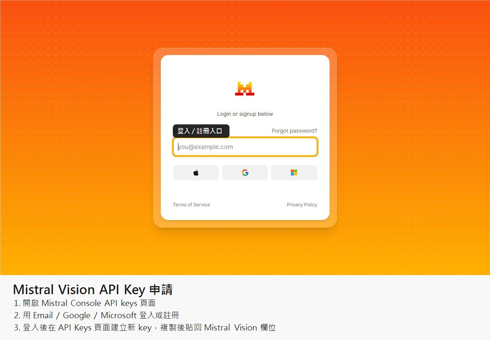
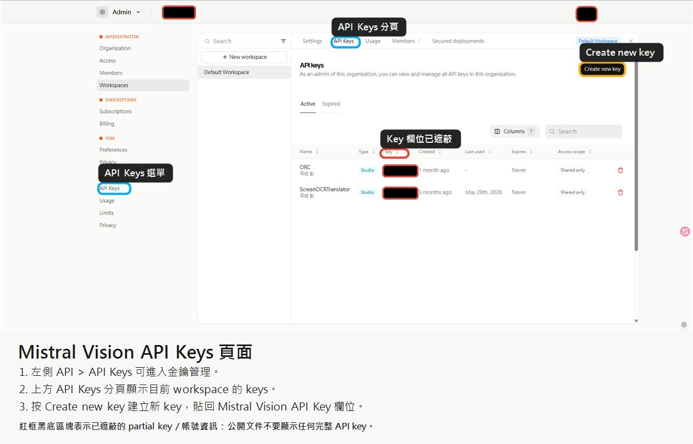
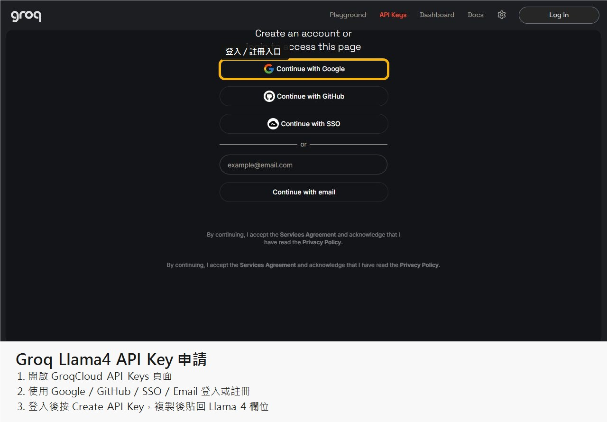
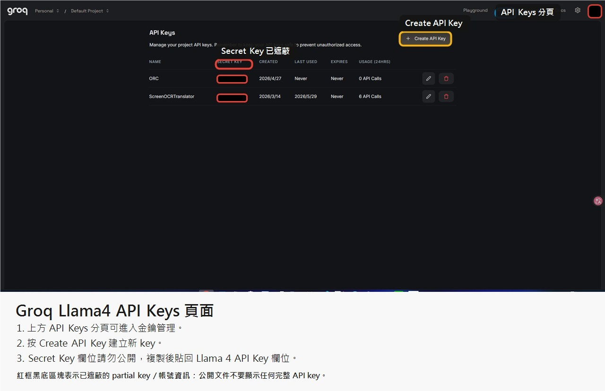

# API Key 申請截圖教學

本教學示範如何進入 Gemini、Mistral Vision 與 Groq Llama4 的 API key 申請頁面。每個供應商都包含登入/註冊頁面與登入後的 API Keys 管理頁面；截圖中的 partial key、帳號或專案識別資訊已用黑框遮蔽。

安全提醒：

- API key 只會在建立時完整顯示一次，請立即保存到自己的密碼管理工具。
- 不要把 API key 貼到 GitHub、截圖、聊天紀錄或公開文件。
- 若截圖中出現 API key，請先用黑框完整塗黑再分享。

## Gemini API Key

官方入口：[Google AI Studio API keys](https://aistudio.google.com/app/apikey)

操作流程：

1. 開啟 Google AI Studio API keys 頁面。
2. 在登入頁輸入 Google 帳號，按 `下一步` 完成登入。
3. 登入後會回到 API keys 頁面。
4. 在 API keys 頁面按 `Create API key`。
5. 複製產生的 key，貼回 ScreenOCRTranslator 的 `Gemini API Key` 欄位。

登入頁面：

登入後 API Keys 頁面：

## Mistral Vision API Key

官方入口：[Mistral Console API keys](https://console.mistral.ai/api-keys/)

操作流程：

1. 開啟 Mistral Console API keys 頁面。
2. 在登入頁使用 Email、Google、Microsoft 或其他支援方式登入/註冊。
3. 登入後會回到 API Keys 頁面。
4. 在 API Keys 頁面建立新的 API key。
5. 複製產生的 key，貼回 ScreenOCRTranslator 的 `Mistral Vision API Key` 欄位。

登入頁面：

登入後 API Keys 頁面：

## Groq Llama4 API Key

官方入口：[GroqCloud API Keys](https://console.groq.com/keys)

操作流程：

1. 開啟 GroqCloud API Keys 頁面。
2. 在登入頁使用 Google、GitHub、SSO 或 Email 登入/註冊。
3. 若進入其他頁面，可切到上方 `API Keys` 分頁。
4. 登入後按 `Create API Key` 建立新的 key。
5. 複製產生的 key，貼回 ScreenOCRTranslator 的 `Llama 4 API Key` 欄位。

登入頁面：

登入後 API Keys 頁面：

