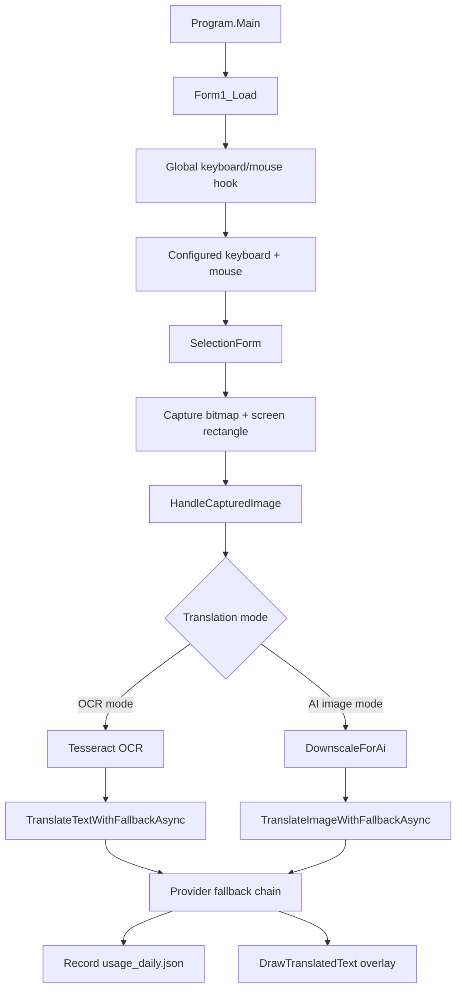

# ScreenOCRTranslator 程式開發說明文件

本文件依據 `C:\ScreenOCRTranslator` 目前程式碼整理，目標是讓後續維護者能快速理解專案架構、執行流程、主要功能、擴充點與建置方式。

目前版號：`V01.001`。

## 1. 專案定位

`ScreenOCRTranslator` 是 Windows 桌面截圖 OCR / 翻譯工具。使用者可設定「鍵盤鍵 + 滑鼠鍵」作為啟動組合，鍵盤部分以小寫顯示，預設為 `q + Left`，按住兩鍵後框選螢幕區域，程式會擷取該區域，依模式執行：

- `OCR 模式（省 token）`：先用本機 `Tesseract` OCR 辨識文字，再把辨識結果送到 LLM 翻譯成繁體中文。
- `AI 圖像翻譯`：把框選圖片縮圖、裁切後，直接送給 vision LLM 做 OCR 與翻譯。

翻譯結果會以透明置頂 overlay 覆蓋在原框選位置，並可設定顯示秒數或用滑鼠右鍵關閉。

## 2. 技術棧與外部依賴

- 平台：Windows Forms
- Runtime：`.NET 10 Windows Desktop`
- 語言：C#，`LangVersion latest`
- 專案檔：`ScreenOCRTranslator.csproj`
- 方案檔：`ScreenOCRTranslator.sln`
- NuGet 套件管理：SDK-style `PackageReference`
- 主要套件：
  - `Tesseract 5.2.0`：本機 OCR。
  - `MouseKeyHook 5.7.1`：全域鍵盤與滑鼠 hook。
  - `Newtonsoft.Json 13.0.4`：API payload / response 與使用量 JSON。
  - `System.Configuration.ConfigurationManager 10.x`：支援現有 `Properties.Settings.Default` 設定流程。

`tessdata` 內含：

- `chi_tra.traineddata`
- `chi_sim.traineddata`
- `jpn.traineddata`
- `eng.traineddata`

這些檔案在 `ScreenOCRTranslator.csproj` 設定為 `EmbeddedResource`。程式啟動時由 `TessdataResourceExtractor` 解壓到 `%LOCALAPPDATA%\ScreenOCRTranslator\tessdata`，供 `TesseractEngine` 使用。

## 3. 目錄與檔案角色

| 路徑 | 角色 |
| --- | --- |
| `Program.cs` | 應用程式入口，啟動 `Form1`。 |
| `TessdataResourceExtractor.cs` | 從內嵌資源解壓 OCR 語言資料到使用者 AppData。 |
| `Form1.cs` | 主要 UI、全域 hotkey、截圖、OCR、翻譯流程、overlay、系統匣與 quota 面板。 |
| `Form1.Designer.cs` | Windows Forms UI 控制項定義。 |
| `SelectionForm.cs` | 螢幕框選視窗，負責截圖與回傳螢幕絕對座標。 |
| `GeminiClient.cs` | Google Gemini `generateContent` API client，支援文字翻譯與圖片 OCR+翻譯。 |
| `LlmClients.cs` | OpenAI-compatible chat completion client，以及 LLM provider / credential / error policy。 |
| `DailyQuotaTracker.cs` | 每日使用量、成功/失敗次數、token 與預設 quota 顯示資料。 |
| `Settings.cs` | `Properties.Settings` partial class，目前只保留事件 hook 範本。 |
| `App.config` | user settings 預設值。 |
| `Properties/Settings.settings` | 使用者設定 schema。 |
| `.github/workflows/dotnet-desktop.yml` | GitHub Actions 設定。若要同步改為 .NET 10 publish 流程，推送帳號或 token 需要 GitHub `workflow` scope。 |
| `README.md` | 使用者向功能說明與版本說明。 |
| `images/` | README 截圖素材。 |
| `tessdata/` | OCR 語言資料。 |

## 4. 啟動與初始化流程

啟動鏈：

```text
Program.Main
  -> Application.SetHighDpiMode(HighDpiMode.PerMonitorV2)
  -> TessdataResourceExtractor.EnsureTessdata()
  -> Application.EnableVisualStyles()
  -> Application.Run(new Form1())
  -> Form1_Load
```

專案檔同時設定 `ApplicationHighDpiMode=PerMonitorV2`。這是框選 overlay 的必要條件，避免 Windows 在「縮放與配置」為 125% / 150% 等比例時對整個 WinForms 視窗做 DPI virtualization，造成背景截圖與框選座標被放大或錯位。`SelectionForm` 與 `TranslationOverlayForm` 皆使用 `AutoScaleMode.None`，因為它們的 `Bounds` 直接使用螢幕像素座標，不應再被 WinForms 字型或 DPI autoscaling 調整。

`Form1_Load` 負責：

1. 初始化 Gemini、Mistral Vision、Groq Llama4 的模型下拉選單。
2. 從 `Properties.Settings.Default` 載入 API Key、模型、啟動鍵、翻譯模式、OCR 語言、overlay 秒數。
3. 建立 `monitorTimer`，用於滑鼠 idle 後自動擷取游標附近區域。
4. 透過 `Hook.GlobalEvents()` 註冊全域鍵盤與滑鼠事件。
5. 初始化 API Key 申請連結。
6. 初始化系統匣 `NotifyIcon`。
7. 從 `Application.StartupPath\usage_daily.json` 載入每日使用量資料。

關閉鏈：

```text
Form1_FormClosing
  -> 顯示關閉 / 縮到系統匣 / 取消提示
  -> 儲存 Settings
  -> 儲存 usage_daily.json
  -> dispose globalHook / cursorHint / trayIcon / trayMenu
```

## 5. 核心使用流程

### 5.1 可設定啟動鍵框選翻譯

主流程：

```text
GlobalHook_KeyDown
  -> _activationKeyboardPressed = true

GlobalHook_MouseDownExt
  -> 滑鼠鍵符合 _activationMouseButton 且 _activationKeyboardPressed
  -> StartSelectionOverlay()

StartSelectionOverlay
  -> new SelectionForm()
  -> 訂閱 OnSelectionCompleted
  -> selector.Show()

SelectionForm.OnMouseUp
  -> 計算 selectedRectScreen
  -> Graphics.CopyFromScreen 擷取 bitmap
  -> OnSelectionCompleted(capture, absoluteRect)

Form1.HandleCapturedImage
  -> 依 cmbTranslationMode.SelectedIndex 選擇 OCR 模式或 AI 圖像翻譯
  -> 成功後 DrawTranslatedText
```

啟動鍵由 `cmbActivationKeyboardKey` 與 `cmbActivationMouseButton` 設定，預設為 `q + Left`，會儲存在 `ActivationKeyboardKey` 與 `ActivationMouseButton`。鍵盤下拉與提示文字一律以小寫顯示；讀取設定時仍大小寫不敏感。滑鼠右鍵不在選單內，保留給 overlay 右鍵關閉使用。`SelectionForm` 只覆蓋游標所在螢幕，所以多螢幕環境下會用 `Screen.FromPoint(Cursor.Position)` 決定框選視窗範圍。回傳的 `Rectangle` 是螢幕絕對座標，可為負值，overlay 也使用同一座標顯示。DPI 縮放比例變更時，必須維持 `PerMonitorV2` 與 overlay `AutoScaleMode.None`，否則 `CopyFromScreen` 的 bitmap 與 WinForms 視窗座標會被 Windows 放大或虛擬化。

### 5.2 OCR 模式

觸發條件：`cmbTranslationMode.SelectedIndex == 0`

流程：

```text
HandleCapturedImage
  -> GetSelectedLanguageCode()
  -> new TesseractOcrProcessor(langCode, picturePreview)
  -> PerformOCR(captured)
  -> TranslateTextWithFallbackAsync(prompt)
  -> DrawTranslatedText(translated, lastCapturedRegion)
```

語言對應：

| UI 顯示 | Tesseract language code |
| --- | --- |
| `繁體中文` | `chi_tra` |
| `簡體中文` | `chi_sim` |
| `日文` | `jpn` |
| `英文` | `eng` |

`TesseractOcrProcessor.PerformOCR` 的影像前處理重點：

1. 建立放大圖，但目前實際灰階處理仍使用原圖尺寸。
2. 轉灰階。
3. 套用銳化濾鏡。
4. 依平均亮度做 threshold。
5. 建立二值化 bitmap。
6. 使用 `TesseractEngine(TessdataResourceExtractor.EnsureTessdata(), _language, EngineMode.LstmOnly)` OCR。

OCR 結果會先顯示在 `txtResult`，再包成提示詞送 LLM 翻譯。

### 5.3 AI 圖像翻譯模式

觸發條件：`cmbTranslationMode.SelectedIndex == 1`

流程：

```text
HandleCapturedImage
  -> DownscaleForAi(captured)
  -> picturePreview.Image = ds.Image.Clone()
  -> TranslateImageWithFallbackAsync(ds.Image)
  -> DrawTranslatedText(translated, lastCapturedRegion)
```

`DownscaleForAi` 目的：

- 減少圖片 token 成本。
- 裁掉大量留白。
- 保留文字行高下限，避免縮太小造成 vision OCR 失敗。

處理步驟：

1. `EstimateTextBoundsAndLineCount` 估計文字墨跡範圍與行數。
2. 依 `inkBounds` 加 padding 裁切。
3. 依文字行高、最大寬高、最大 pixel 數決定縮放比例。
4. `CropBitmap` 後再 `ResizeBitmap`。

目前 `HandleCapturedImage` 呼叫參數為：

```text
targetLinePx: 16
minLinePx: 14
cropToInk: true
cropPadPx: 6
maxPixels: 200000
```

## 6. LLM provider 與 fallback 機制

Provider 建立於 `Form1.BuildLlmCredentials()`，順序固定：

1. `Gemini`
   - 條件：Gemini API Key 不為空且有選模型。
   - Client：`GeminiClient`
   - API：`https://generativelanguage.googleapis.com/v1beta/models/{model}:generateContent`
   - 預設模型：`gemini-3.1-flash-lite`
2. `Mistral Vision`
   - 條件：Mistral API Key 不為空且有選模型。
   - Client：`OpenAiCompatibleClient`
   - Base URL：`https://api.mistral.ai/v1`
   - 預設模型：`mistral-large-2512`
3. `Groq Llama4`
   - 條件：Groq API Key 不為空且有選模型。
   - Client：`OpenAiCompatibleClient`
   - Base URL：`https://api.groq.com/openai/v1`

文字翻譯使用 `TranslateTextWithFallbackAsync`，圖片翻譯使用 `TranslateImageWithFallbackAsync`。兩者 fallback 邏輯一致：

- 已設定 provider 成功：`HttpStatus == 200` 且 `Error` 空白，記錄成功並回傳。
- 未填 API Key 的雲端 provider 不加入 fallback 候選。
- quota / rate limit、模型不存在、認證失敗、網路錯誤與 5xx：由 `LlmErrorPolicy.ShouldSwitchProvider` 或例外判斷，若後面還有 provider 就切換。
- 非可切換錯誤：直接回傳錯誤，不繼續切換。
- 全部已設定 provider 無法使用時：回傳 `所有已設定模型/API KEY皆無法使用`。

## 7. API client 實作

### 7.1 `GeminiClient`

主要方法：

- `TranslateTextEx(string inputText)`
- `SendImageForOCRAndTranslateEx(Bitmap image)`

圖片 payload 使用：

- `inlineData.mimeType = "image/png"`
- prompt：`擷取圖片中所有可見文字並翻譯成繁體中文，只輸出譯文。`
- generation config：
  - `thinking_budget = 0`
  - `temperature = 0.0`
  - `candidate_count = 1`
  - `response_mime_type = "text/plain"`
  - `media_resolution = "MEDIA_RESOLUTION_LOW"`，僅圖片路徑使用。

`BuildErrorResult` 會解析：

- HTTP status
- `error.message`
- `Retry-After`
- `RetryInfo.retryDelay`
- `QuotaFailure.quotaId`
- 是否為每日 quota：`IsDailyQuotaExceeded`

`ParseGenerateContentResponse` 會解析：

- `candidates[0].content.parts[0].text`
- `usageMetadata.promptTokenCount`
- `usageMetadata.candidatesTokenCount` 或 `responseTokenCount`
- `usageMetadata.totalTokenCount`
- `thoughtsTokenCount` 等 Gemini 額外 token 欄位。

注意：`GeminiClient.cs` 目前沒有放在 `ScreenOCRTranslator` namespace 內，但其他檔案透過 `using static GeminiClient` 直接引用其 nested types。這是既有結構，若要整理 namespace，需要同步調整所有引用。

### 7.2 `OpenAiCompatibleClient`

主要支援：

- 文字翻譯：`messages[].content` 為純文字。
- 圖片翻譯：`messages[].content` 為 text + `image_url` data URI。
- API endpoint 固定組成：`{baseUrl}/chat/completions`
- 若 API Key 不空，加入 `Authorization: Bearer {apiKey}`。

Response 解析採 OpenAI-compatible 格式：

- `choices[0].message.content`
- `usage.prompt_tokens`
- `usage.completion_tokens`
- `usage.total_tokens`

## 8. 使用量與 quota 面板

`DailyQuotaTracker` 使用檔案：

```text
Application.StartupPath\usage_daily.json
```

資料每天自動重置，依 `yyyy-MM-dd` 判斷。每筆 `DailyQuotaEntry` 包含：

- provider
- model
- 成功請求數
- 失敗請求數
- prompt / output / total tokens
- daily limit
- RPM limit
- last error

`QuotaBoardForm` 是 `Form1.cs` 內部類別，用 `DataGridView` 顯示快照。按主畫面 `今日引擎使用量` 會呼叫 `ShowQuotaBoard()`，快照來源為：

```text
_quotaTracker.GetSnapshot(BuildLlmCredentials())
```

## 9. Overlay 與使用者回饋

### 9.1 翻譯結果 overlay

`DrawTranslatedText` 建立 `TranslationOverlayForm`，其特性：

- `TopMost = true`
- `ShowInTaskbar = false`
- `ShowWithoutActivation = true`
- `WS_EX_TRANSPARENT`：滑鼠事件可穿透。
- `WS_EX_NOACTIVATE`：顯示時不搶焦點。
- 背景黑色，`Opacity = 0.85`
- 文字用 `Microsoft JhengHei` 粗體。
- 用二分搜尋找最大可容納字級。
- 依 `numOverlaySeconds` 自動關閉。

滑鼠右鍵若在 overlay 範圍內，`GlobalHook_MouseDownExt` 會呼叫 `CloseOverlay()` 並 `e.Handled = true`。

### 9.2 游標旁提示

`CursorHintForm` 用於顯示：

- `翻譯中...`
- `翻譯失敗`

失敗時 `ShowCursorFailureThenHideAsync` 會顯示 2 秒後隱藏。

## 10. 其他功能流程

### 10.1 按鈕截圖 OCR

`btnCapture_Click` 會開啟 `SelectionForm`，框選後只做本機 OCR，並把 OCR 結果顯示在 `txtResult`。依目前程式碼，這個按鈕文字是 `擷取 + 翻譯`，但事件內容沒有呼叫翻譯流程。

### 10.2 滑鼠 idle 偵測

`btnStartStop_Click` 會啟動或停止 `monitorTimer`。啟動時要求 Gemini API Key 與模型，並建立 `geminiClient`。`MonitorTimer_Tick` 偵測游標停止達 `numIdleSeconds` 後，會擷取游標附近 `300x150` 區域並做本機 OCR。

依目前程式碼，這條 idle 流程的 Gemini 翻譯呼叫被註解掉，因此只會 OCR，不會送翻譯。

### 10.3 系統匣

`InitializeTrayIcon` 建立右鍵選單：

- `開啟主視窗`
- `結束`

使用者關閉主視窗時，若選擇縮小，會執行 `HideToTray()`。雙擊系統匣 icon 會 `ShowFromTray()`。

## 11. 設定與持久化

使用者設定由 `Properties.Settings.Default` 管理，關閉程式時儲存。主要欄位：

- `ApiKey`
- `ModelName`
- `TranslationModeIndex`
- `LanguageModeIndex`
- `OverlaySeconds`
- `ActivationKeyboardKey`
- `ActivationMouseButton`
- `ApiKey_MistralPixtral`
- `ModelName_MistralPixtral`
- `ApiKey_Llama4`
- `ModelName_Llama4`

預設值也存在 `App.config` 的 `userSettings` 區塊。

## 12. 建置與開發環境

建議環境：

1. Windows 10 / 11。
2. Visual Studio 2022 / 2026 或 Build Tools。
3. `.NET 10 SDK` 與 Windows Desktop workload / targeting pack。

本機建置指令：

```powershell
cd C:\ScreenOCRTranslator
dotnet restore ScreenOCRTranslator.sln
dotnet build ScreenOCRTranslator.sln -c Debug
dotnet build ScreenOCRTranslator.sln -c Release
dotnet publish ScreenOCRTranslator.csproj -c Release -r win-x64 --self-contained true -p:PublishSingleFile=true -p:PublishTrimmed=false -p:PublishReadyToRun=false -p:DebugType=None -p:DebugSymbols=false -o publish\win-x64
```

GitHub Actions 可改用相同概念；更新 `.github/workflows/dotnet-desktop.yml` 時，推送帳號或 token 需要 GitHub `workflow` scope：

```text
actions/setup-dotnet@v4
dotnet restore ScreenOCRTranslator.sln
dotnet build ScreenOCRTranslator.sln -c Debug
dotnet build ScreenOCRTranslator.sln -c Release
dotnet publish ScreenOCRTranslator.csproj -c Release -r win-x64 --self-contained true -p:PublishSingleFile=true -p:PublishTrimmed=false -p:PublishReadyToRun=false
```

輸出位置依專案設定：

- Debug：`bin\Debug\net10.0-windows7.0\win-x64\`
- Release：`bin\Release\net10.0-windows7.0\win-x64\`
- 單檔發佈：`publish\win-x64\ScreenOCRTranslator.exe`

## 13. 擴充指南

### 13.1 新增 LLM provider

建議修改位置：

1. `LlmClients.cs`
   - 在 `LlmProvider` enum 新增 provider。
   - 若非 OpenAI-compatible，新增對應 client。
   - 擴充 `LlmErrorPolicy`，讓 quota / rate limit 判斷涵蓋新 provider。
2. `Form1.Designer.cs`
   - 新增 API Key / model UI 控制項。
3. `Form1.cs`
   - `Form1_Load`：初始化模型選單與連結。
   - `Form1_FormClosing`：儲存新 provider 設定。
   - `BuildLlmCredentials`：依 fallback 順序加入新 provider。
4. `Properties/Settings.settings` 與 `App.config`
   - 加入 API Key、model 預設值。
5. `DailyQuotaTracker.cs`
   - `_defaults` 加入 quota / RPM 預設。
   - `MapProvider` 加入 provider 名稱映射。

### 13.2 調整 OCR 品質

主要修改位置：

- `Form1.cs` 的 `TesseractOcrProcessor.PerformOCR`
- `ApplySharpenFilter`
- threshold 邏輯
- `GetSelectedLanguageCode`
- `tessdata` 語言資料

注意事項：

- 若新增語言，需加入對應 `.traineddata`，並在 `.csproj` 設定為 `EmbeddedResource`，同步更新 `TessdataResourceExtractor` 的檔名清單。
- OCR 前處理目前使用大量 `GetPixel` / `SetPixel`，大圖可能效能較差；若要優化，可改用 `LockBits`。

### 13.3 調整 AI 圖像送出成本

主要修改位置：

- `DownscaleForAi`
- `EstimateTextBoundsAndLineCount`
- `HandleCapturedImage` 內的 `DownscaleForAi` 呼叫參數。
- `GeminiClient.SendImageForOCRAndTranslateEx` 的 `media_resolution` 與 `max_output_tokens`。
- `OpenAiCompatibleClient.SendImageForOCRAndTranslateEx` 的 `max_tokens`。

降低 token 的方向：

- 降低 `maxPixels`
- 降低 `targetLinePx`
- 保持 `cropToInk = true`
- 縮短 prompt

提高辨識品質的方向：

- 提高 `targetLinePx`
- 提高 `minLinePx`
- 增加 `cropPadPx`
- 放寬 `maxPixels`

### 13.4 修改 overlay 行為

主要修改位置：

- `DrawTranslatedText`
- `GetOverlayDurationMs`
- `TranslationOverlayForm`
- `GlobalHook_MouseDownExt` 右鍵關閉邏輯

常見需求：

- 改字色：`TranslationOverlayForm.OnPaint`
- 改背景透明度：`Opacity`
- 改字型：`UpdateFontToFit`
- 改自動關閉秒數：`numOverlaySeconds` 與 `OverlaySeconds`

## 14. 已觀察到的維護注意事項

1. `Form1.cs` 承擔過多責任，包含 UI、OCR、圖片處理、LLM fallback、overlay 與 quota UI。若後續功能擴大，建議逐步拆成 service 類別。
2. `btnCapture_Click` 的 UI 文字是 `擷取 + 翻譯`，但目前只做 OCR，容易造成使用者誤解。
3. `MonitorTimer_Tick` 的 Gemini 翻譯程式碼被註解，目前 idle 模式只會 OCR。
4. `GeminiClient.cs` 位於 global namespace，與其他 `ScreenOCRTranslator` namespace 類別風格不一致。
5. `TesseractOcrProcessor.PerformOCR` 有建立 `scaled` bitmap，但目前後續處理未使用該放大圖，需確認這是否為遺留實作。
6. 大量影像處理使用 `GetPixel` / `SetPixel`，小圖可接受，大圖會拖慢 UI thread。
7. API Key 目前透過 user settings 保存，適合個人工具，但若要多人或企業環境發佈，需評估敏感資訊保護。

## 15. 建議測試清單

每次修改核心流程後，至少檢查：

1. `dotnet restore ScreenOCRTranslator.sln`
2. `dotnet build ScreenOCRTranslator.sln -c Debug`
3. `dotnet build ScreenOCRTranslator.sln -c Release`
4. `dotnet publish ScreenOCRTranslator.csproj -c Release -r win-x64 --self-contained true -p:PublishSingleFile=true -p:PublishTrimmed=false -p:PublishReadyToRun=false -p:DebugType=None -p:DebugSymbols=false -o publish\win-x64`
5. 啟動 `publish\win-x64\ScreenOCRTranslator.exe`，確認 settings 可載入與儲存。
6. 第一次啟動後確認 `%LOCALAPPDATA%\ScreenOCRTranslator\tessdata` 有四個 `.traineddata`。
7. 預設 `q + Left` 框選單螢幕區域。
8. 預設 `q + Left` 框選副螢幕區域。
9. Windows「縮放與配置」設為 125% 或 150% 後，預設 `q + Left` 框選時 overlay 不應放大整個桌面，框選座標與截圖範圍需一致。
10. 改成 `F8 + Middle` 後，舊組合不啟動，新組合可啟動；重開程式後設定仍保留。
11. OCR 模式：繁中、簡中、日文、英文至少各一張樣本。
12. AI 圖像翻譯模式：確認縮圖資訊、API 回傳、overlay 顯示。
13. provider fallback：用無效 / 429 API Key 驗證是否切換下一個已設定 provider。
14. 若測試流程需要 Gemini / Mistral / Groq API Key 但目前未填，停止測試並等待使用者輸入後再繼續。
15. overlay 自動關閉與右鍵關閉。
16. `今日引擎使用量` 是否更新成功與失敗次數。
17. 關閉視窗時三個選項：關閉、縮到系統匣、取消。

## 16. 快速流程圖


