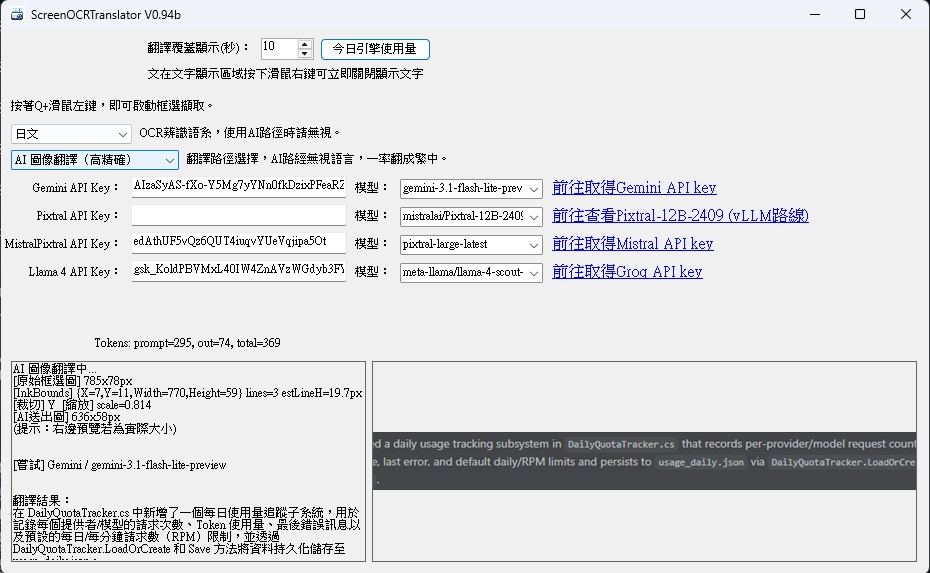
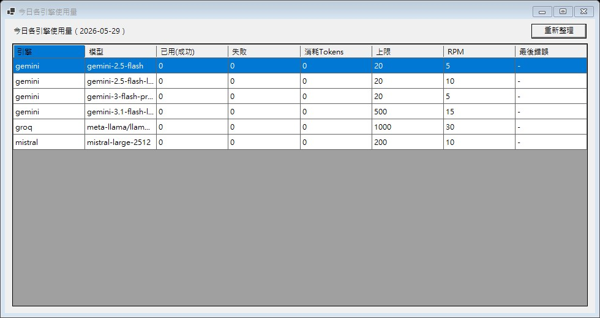

# ScreenOCRTranslator 
 

 
 
這款工具可以用來翻譯遊戲畫面或其他應用程式中的文字，非常方便。 

使用說明 

取得 API Key：可依你要用的引擎分別申請（Gemini / Mistral / Groq）。 
設定軟體：將對應 API Key 貼入各自欄位，並選擇模型；Gemini 預設為 gemini-3.1-flash-lite，Mistral Vision 預設為 mistral-large-2512。 
API Key 申請教學：請看 [API_KEY_GUIDE.md](API_KEY_GUIDE.md)，內含 Gemini、Mistral Vision、Groq Llama4 的瀏覽器截圖教學與 API key 塗黑提醒。 
進行翻譯：可在主畫面設定啟動鍵盤鍵與滑鼠鍵，預設為 q 鍵 + 滑鼠左鍵，按住兩鍵後框選畫面中想要翻譯的區域。 
完成翻譯：系統會自動辨識並翻譯為繁體中文，並將翻譯後文字覆蓋在原始位置上。 
配額與用量：可點「今日引擎使用量」查看當日各模型的成功次數、失敗次數、消耗 Tokens、上限與 RPM。 
發佈版本：目前改為 .NET 10 Windows Forms，可用 `dotnet publish` 產出 win-x64 self-contained 單一執行檔。 
單檔輸出：`publish\win-x64\ScreenOCRTranslator.exe` 可直接攜帶使用；OCR 語言資料會在第一次啟動時自動解壓到使用者 AppData。 
建置指令：`dotnet restore`、`dotnet build -c Release`、`dotnet publish ScreenOCRTranslator.csproj -c Release -r win-x64 --self-contained true -p:PublishSingleFile=true -p:PublishTrimmed=false -p:PublishReadyToRun=false -p:DebugType=None -p:DebugSymbols=false -o publish\win-x64`。 
Visual Studio 發布請使用 `FolderProfile`，不要勾選「修剪未使用的程式碼」；Windows Forms 不支援 trimming。 
版本說明 
V01.000 

專案架構升級為 .NET 10 SDK-style Windows Forms，支援 win-x64 self-contained single-file 發佈。 
OCR 語言資料改為內嵌資源，單檔執行時會自動解壓到 `%LOCALAPPDATA%\ScreenOCRTranslator\tessdata`。 
新增可儲存的啟動鍵設定，可分別選擇鍵盤鍵與滑鼠鍵，鍵盤部分以小寫顯示，預設為 q + 滑鼠左鍵。 
更新 Gemini 模型名稱為 gemini-3.1-flash-lite，舊的 gemini-3.1-flash-lite-preview 會自動改用新名稱。 
更新 Mistral Vision 模型為 mistral-large-2512，取代已淘汰的 Pixtral Large 雲端模型。 
新增多引擎自動切換機制：Gemini → Mistral Vision → Groq Llama4。 
當遇到配額、速率限制、模型不支援、認證失敗、網路錯誤或伺服器錯誤時，會自動切換到下一個已設定模型。 
全部已設定引擎都無法使用時，會顯示「所有已設定模型/API KEY皆無法使用」。 
新增 Mistral Vision / Llama4 的 API Key 與模型欄位，並可分別儲存。 
新增各 API key 申請連結（Gemini、Mistral、Groq）。 
新增關閉視窗提示：可選擇「關閉程式」、「縮小到右下角常駐」或「取消」。 
新增「今日引擎使用量」面板：顯示每個引擎/模型的成功請求、失敗計數、Tokens 用量、上限與 RPM，並每日自動更新。 
配額統計改為「成功請求為主、失敗另列計數」，便於判讀實際消耗。 
更新新版主畫面與 Tokens 用量截圖，並移除 Tokens 面板中的舊 Pixtral 佔位列。 
新增 `API_KEY_GUIDE.md`，提供 Gemini、Mistral Vision、Groq Llama4 的登入頁面、API key 申請截圖教學與獨立塗黑範例。 

V0.94b 
1.送出 AI 翻譯請求時，會在滑鼠游標旁顯示「翻譯中...」。 
2.翻譯失敗時，會在滑鼠游標旁顯示「翻譯失敗」，2 秒後自動恢復。 
3.框選視窗維持灰色半透明遮罩，並讓框選邊框（淺藍外框＋紅色內框）以實色清楚顯示。 
4.支援縮小到右下角系統匣常駐，可從系統匣快速還原或結束程式。 

V0.93b 
1.降低圖片大小以降低Token使用量。 
2.提高OCR辨識率。 
3.顯示翻譯時間可設定，在顯示區域按滑鼠右鍵可立即取消顯示。 
4.增加Gemini API key申請連結。 
5.增加使用說明，Tokens消耗量，錯誤說明。 

V0.92b 
1.新增字型大小可隨著擷取框大小自動變化。 
2.拿掉Gemini 2.0系列模型，保留2.5與3.0，無法使用所以移除。 

V0.91b 
1.移除程式開啟時焦點停留在API key處，避免誤觸清空API key。 
2.新增雙螢幕擷取功能。 

V0.9b 
1.第一版測試版。 
